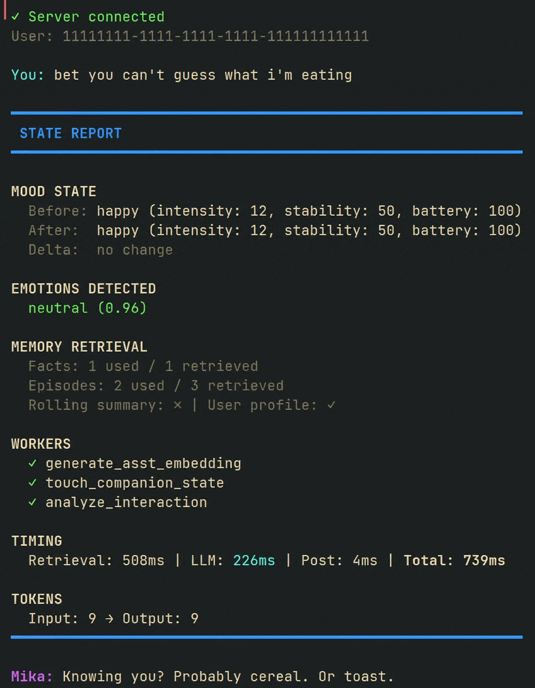
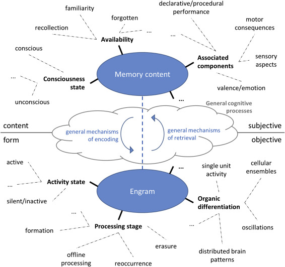
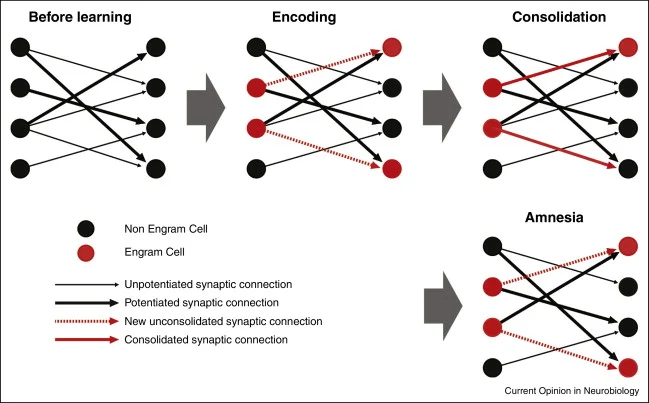
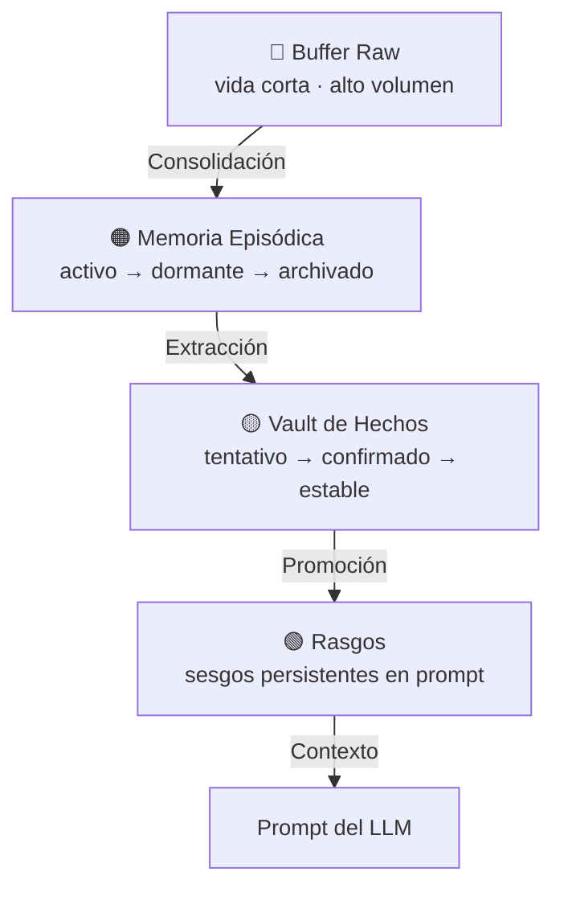
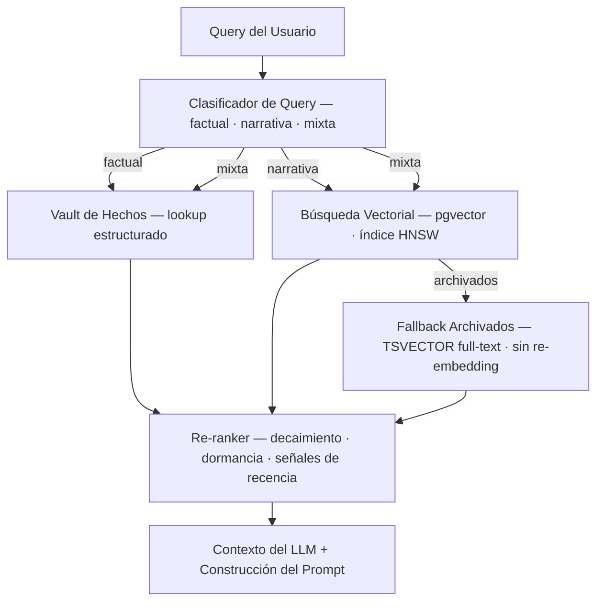
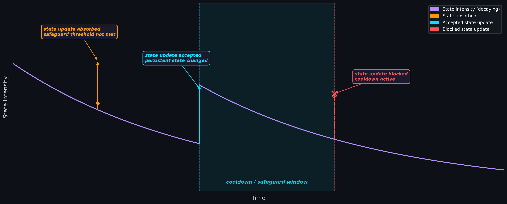
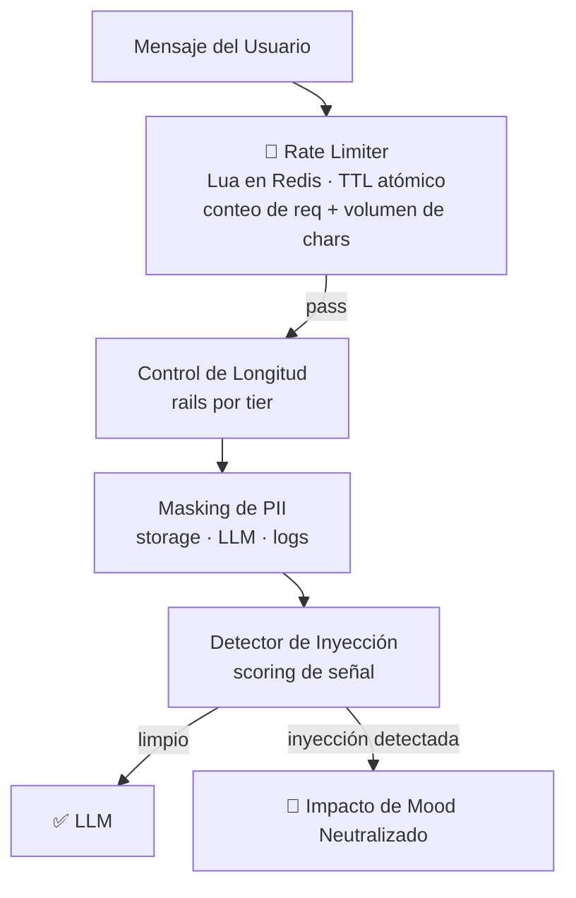
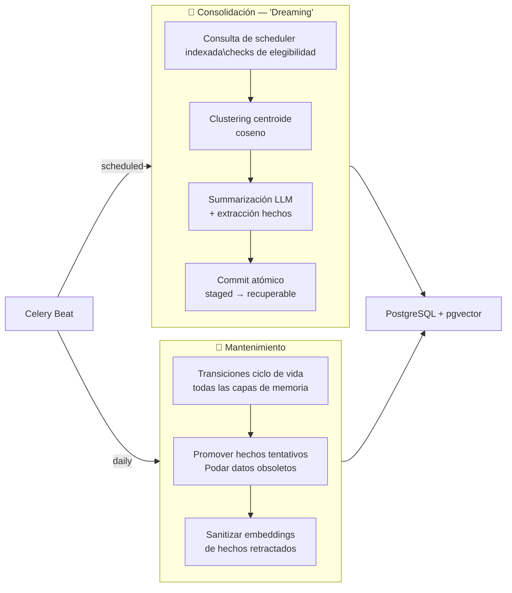
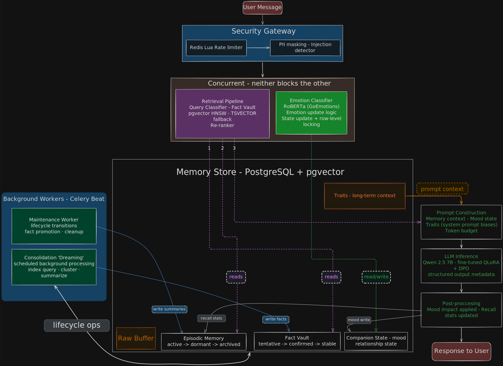

  <strong>🇦🇷 Español</strong> | <a href="README.md">🇺🇸 English</a>

# Mika — Engrama

---

Un sistema de IA a largo plazo diseñada para construir relaciones reales y evolutivas con los usuarios a través de memoria estructurada, modelado emocional dinámico y generación de lenguaje con conciencia de personalidad.

## Highlights

> Infraestructura backend para relaciones de IA persistentes y evolutivas. La ingeniería no está en la IA en sí, sino en todo el sistema que la coordina.

- **Hot path async concurrente y seguridad en escrituras**: la recuperación de memoria y la clasificación emocional corren en paralelo; los resultados convergen antes de la construcción del prompt; el row-level locking sobre los registros de estado previene race conditions.
- **Store de memoria multi-nivel PostgreSQL + pgvector**: cuatro capas independientes, cada una con su propio modelo de scoring, máquina de estados de ciclo de vida, lógica de decaimiento y semántica de recuperación; indexado HNSW vectorial con fallback GIN parcial para archivados, sin re-embedding
- **Rate limiting atómico con Redis**: un único script Lua por request inicializa contadores con TTL y verifica tanto el conteo de requests como el volumen de caracteres en un solo round-trip atómico, aplicado por usuario por tier
- **Orquestación distribuida con Celery**: workers en background coordinan procesamiento diferido mediante consultas indexadas del scheduler, safeguards por usuario y commits atómicos diseñados para evitar colisiones con el path de requests en vivo
- **Gateway de input con defensa en profundidad**: masking de PII con políticas separadas para storage, contexto del LLM y logs; detección de señales de prompt injection con neutralización del estado emocional en el output

---

## Qué es

Mika es un sistema de IA backend construido alrededor de una premisa central: la mayoría de los asistentes de IA tratan cada conversación como si fuera la primera. Mika no.

El sistema está diseñado para recordar quién sos — no solo lo que dijiste en la última sesión, sino tus preferencias, tus relaciones, tus patrones emocionales, y cómo todo eso cambia con el tiempo. Luego usa ese conocimiento para moldear cómo la IA responde, se comporta emocionalmente y se relaciona con vos — en cada interacción.

---

## Snapshot de una interacción

Interacción mínima que muestra el flujo de solicitudes en acción: detección de emociones, actualización del estado de la IA, recuperación de memoria, ejecución del proceso en segundo plano, desglose de latencia, uso de tokens y la respuesta final adaptada a la personalidad.

   
  <em style="color: #6a737d; font-size: 18px;">
    Informe de interacción en tiempo real generado a partir de un solo mensaje del usuario. 
  </em>

---

## Por qué Engrama

En neurociencia, un **engrama** es la huella física que un recuerdo deja en el cerebro: el cambio real en la estructura neuronal que hace que una experiencia pasada sea recuperable. No es un log. No es una caché. Es una impronta estructural que moldea el comportamiento futuro.

Esa es la premisa de diseño de este sistema. La memoria aquí no se almacena y recupera simplemente; se acumula, decae, se promueve o retracta, y continuamente reformula cómo la IA se relaciona con vos. El nombre es la arquitectura.

   
  <em style="color: #6a737d; font-size: 18px;">Diagrama linkeando el contenido de la memoria al Engrama a través de encoding y retrieval</em>

   
  <em style="color: #6a737d; font-size: 18px;">Conectividad de las células del Engrama</em>

---

## Capacidades

### Memoria de Largo Plazo por Capas

La memoria está organizada en cuatro niveles distintos, cada uno con un rol y ciclo de vida diferente:

- **Buffer raw**: mensajes crudos de conversación, de vida corta y alto volumen
- **Memoria episódica**: resúmenes narrativos de conversaciones, puntuados por peso emocional y relevancia, con estados de ciclo de vida independientes *(activo → dormante → archivado → eliminado)*
- **Memoria semántica (Vault de hechos)**: hechos discretos y estructurados sobre el usuario, extraídos y validados con el tiempo: preferencias, relaciones, rutinas, señales de comportamiento, datos biográficos. Los hechos avanzan por estados de confianza *(tentativo → confirmado → estable)* y soportan retracción definitiva cuando el usuario corrige el registro
- **Meta-memoria (Rasgos)**: tendencias de comportamiento de alto nivel inferidas con el tiempo *(estilo de comunicación, patrones emocionales, tolerancia al riesgo)*, inyectadas directamente en el system prompt como sesgos persistentes

El sistema sabe la diferencia entre algo que el usuario mencionó una vez y entre el contexto estable a largo plazo.

### Recuperación Inteligente (RAG Multi-Canal)

El sistema de recuperación clasifica cada query antes de decidir cómo buscar. Las preguntas factuales *("¿cómo se llama mi hermana?")* impactan en un lookup estructurado. Las preguntas narrativas *q("¿qué pasó cuando hablamos de ella?")* usan búsqueda vectorial semántica sobre resúmenes episódicos. Las queries de intención mixta ejecutan ambos canales en paralelo.

La búsqueda vectorial usa **pgvector con indexado HNSW**. Las memorias archivadas caen de vuelta a búsqueda de texto completo *(PostgreSQL `TSVECTOR` con índices GIN parciales)* sin re-generar embeddings, preservando eficiencia de almacenamiento. El re-ranking aplica decaimiento de importancia, penalizaciones por dormancia y señales de recencia antes de pasar los candidatos principales al LLM.

En el hot path, la recuperación de memoria y la clasificación de emoción corren de forma concurrente, ninguna bloquea a la otra. Los resultados se fusionan antes de la construcción del prompt, manteniendo la latencia end-to-end acotada independientemente de qué operación tarde más.

### Estado Emocional Dinámico

El estado emocional de Mika es una simulación de física persistente que corre por usuario:

- Un clasificador de emoción local *(`RoBERTa` fine-tuneado en GoEmotions)* corre en cada mensaje del usuario y propone un spike emocional
- El spike atraviesa un sistema de resistencia y resolución de conflictos antes de poder cambiar el estado de mood activo
- La intensidad del mood decae naturalmente con el tiempo mediante una función exponencial por minuto
- Tras cada respuesta del LLM, un score de impacto de mood parseado se aplica al estado, pero solo si el input pasó las **verificaciones de inyección**
- Tanto la aplicación del spike como las escrituras de impacto adquieren un row-level lock sobre el registro de estado de la IA para prevenir race conditions bajo requests concurrentes

El resultado es un mood que reacciona al tono emocional del usuario sin ser manipulado trivialmente, y que se desvanece naturalmente entre interacciones.

   
  <em style="color: #6a737d; font-size: 18px;">Update del estado — Simulación</em>

### Evolución de la Relación

El sistema rastrea la relación usuario–Mika a lo largo de múltiples ejes independientes con scores continuos, umbrales de comportamiento discretos y condiciones de transición explícitas. Las transiciones entre etapas son deliberadas y diseñadas para sentirse ganadas.

### Pipeline de Seguridad de Input

Cada mensaje del usuario atraviesa un gateway de seguridad multicapa antes de llegar al LLM:

- **Rate limiting aplicado por usuario, por tier, mediante un script Lua en Redis**: una operación atómica única que inicializa contadores con TTL y verifica tanto el conteo de requests como el volumen de caracteres en un solo round-trip
- Rails de longitud de mensaje por tier
- **Detección y masking de PII a nivel de input**: políticas de masking separadas para storage, contexto del LLM y logs *(defensa en profundidad, no un único pase)*
- **Detección de señal de prompt injection**: si se detecta inyección, el impacto de mood extraído de la respuesta del LLM se neutraliza antes de aplicarse al estado

El sistema está diseñado para prevenir la manipulación del estado emocional mediante inputs adversariales.

### Inteligencia en Background (Pipeline de Workers)

El sistema ejecuta dos pipelines de workers en background coordinados via **Celery Beat**:

- **Consolidación ("Dreaming")**: un scheduler corre cada cierto tiempo y consulta un índice parcial para encontrar usuarios cuyo conteo de mensajes pendientes supera un umbral y que han estado inactivos el tiempo suficiente. Distingue entre triggers, despachando tareas de Celery en consecuencia. El tracking de backoff por usuario previene que rechazos repetidos del worker desperdicien cómputo.
  - La consolidación en sí segmenta el historial raw en bloques temáticos mediante clustering de centroide coseno, puntúa cada bloque, lo envía al LLM para summarización y extracción de hechos, y commitea el resultado **atómicamente**... incluyendo marcar los mensajes fuente como consolidados y resetear los contadores del scheduler. Los resúmenes recién creados comienzan en estado gestating y solo se vuelven recuperables luego de que se cumplan ciertos criterios, evitando que la IA se auto-referencie en memoria reciente como si fuera historia lejana

- **Mantenimiento**: ejecuta transiciones de ciclo de vida diarias en todas las capas de memoria, promueve hechos tentativos que se confirmaron suficientes veces, poda hechos no validados obsoletos, sanitiza embeddings de hechos retractados para garantizar que nunca puedan aparecer en búsquedas vectoriales, y avanza consolidaciones recién maduradas de gestating a active

### Fine-Tuning y Entrenamiento del Modelo

El LLM base *(Qwen 2.5 7B)* está siendo fine-tuneado sobre un dataset curado diseñado alrededor de la personalidad de la IA y su modelo de interacción. El entrenamiento usa QLoRA para fine-tuning eficiente en parámetros dentro de las restricciones de GPU *(entorno Kaggle T4/P100)*.

La alineación se aplica mediante un dataset DPO curado manualmente usando tripletas de preferencias *(prompt / chosen / rejected)* que cubren escenarios de seguridad, consistencia de personalidad, calibración de tono y casos borde de comportamiento. Todos los datos de entrenamiento usan un formato de metadata estructurado que separa el contexto de runtime *(estado de mood, modo de actividad, nivel de relación...)* del contenido de los mensajes, y se limpia antes del entrenamiento.

Sub-personalidades: múltiples modos de comportamiento manejados en tiempo de inferencia en lugar de variantes de modelo separadas.

---

## Complejidad Técnica

- Store de memoria multi-nivel con FSMs de ciclo de vida, scoring de decaimiento y semántica de recuperación independientes por capa
- Hot path concurrente: recuperación y clasificación emocional en paralelo; resultados fusionados pre-construcción del prompt
- Row-level locking sobre registros de estado; transacciones atómicas delimitadas para no serializar el pipeline completo
- Rate limiting Redis Lua en una sola operación: init TTL + conteo de requests + volumen de caracteres en un round-trip
- Workers coordinan el estado procesable por usuario para evitar colisiones con el hot path
- Presupuestos de tokens por tier de suscripción; truncado de context window como primera clase en cada llamada de inferencia
- Búsqueda vectorial HNSW con fallback GIN parcial para archivados... sin re-embedding
- Dataset DPO curado manualmente con esquema de metadata que generaliza a través de etapas de relación, modos de actividad y estados de mood

---

## Flujo final de la arquitectura

   
  <em style="color: #6a737d; font-size: 18px;">Más diagramas en /assets</em>

---

## Estado

**Desarrollo privado activo**. **Engrama** es la capa de infraestructura backend central: el subsistema de memoria, estado emocional y coordinación de inferencia para un **producto más grande** actualmente en desarrollo. *El alcance completo del producto no es público*.

> **Nota:** Esto es una muestra de alto nivel. La lógica de producto sensible y los detalles de implementación no son públicos.

---

Copyright (c) 2026 Camilo Sassone. Todos los derechos reservados.

Este repositorio es una demostración técnica pública del sistema Engram.
El código fuente del sistema en producción no está incluido.

No se concede permiso para copiar, modificar, redistribuir ni crear
trabajos derivados a partir del contenido de este repositorio sin autorización explícita.

  

