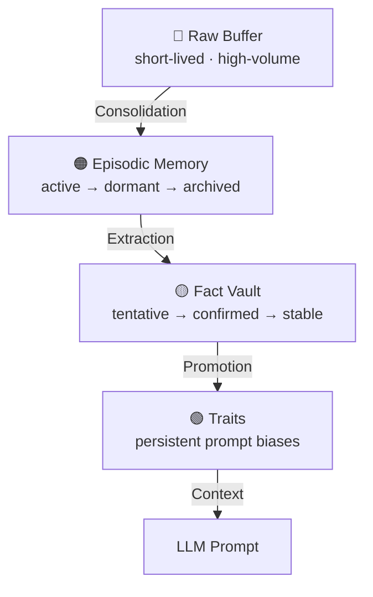
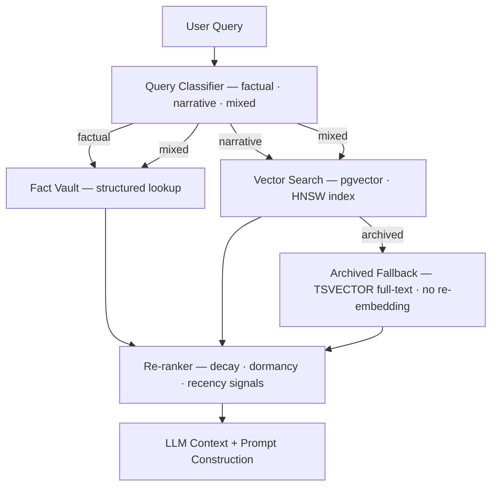
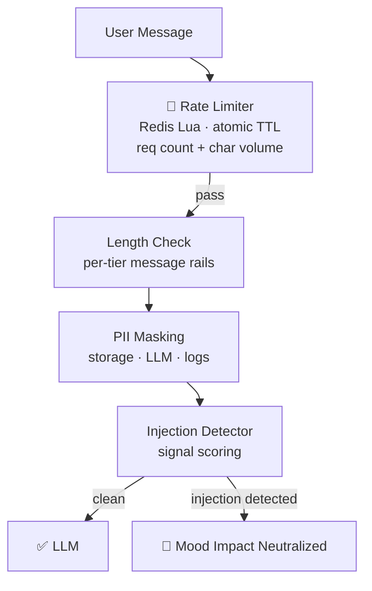
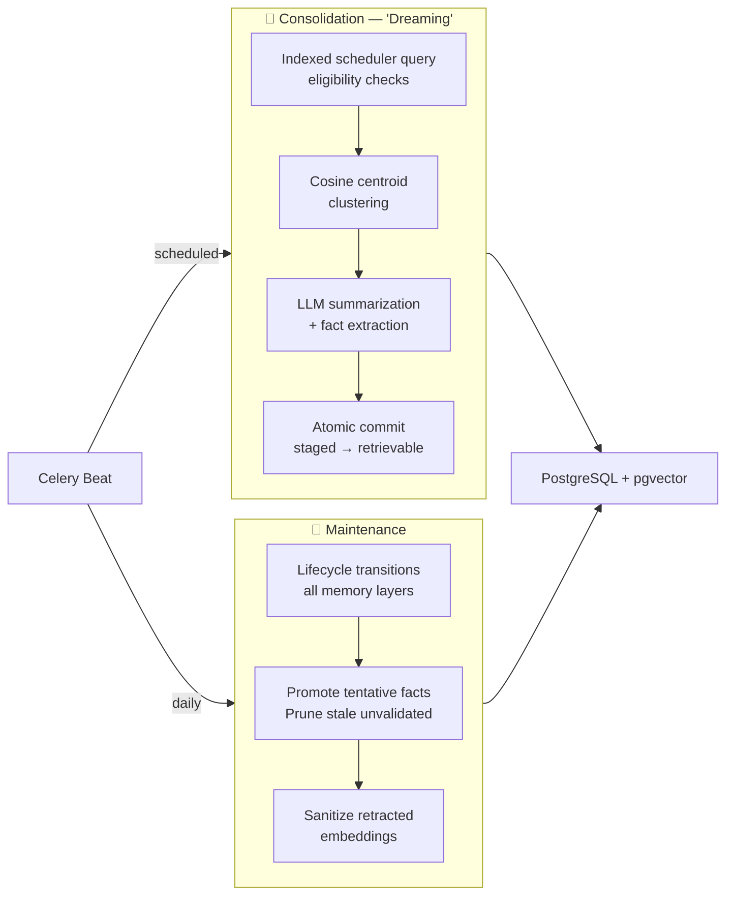

  <strong>🇺🇸 English</strong> | <a href="README.es.md">🇦🇷 Español</a>

# Mika — Engram

---

A long-term AI system designed to build real, evolving relationships with users through structured memory, dynamic emotional modeling, and personality-aware language generation.

## Highlights

> Backend infrastructure for persistent and evolving AI relationships. The engineering is not the AI itself but the whole system coordinating it.

- **Concurrent async hot path and write safety**: memory retrieval and emotion classification run in parallel; results converge before prompt construction; row-level locking on the AI system state records prevents race conditions.
- **Multi-level PostgreSQL + pgvector memory store**: four independent layers, each with its own scoring model, lifecycle state machine, decay logic, and retrieval semantics; HNSW vector indexing with partial GIN full-text fallback for archived records, no re-embedding required
- **Atomic Redis rate limiting**: a single Lua script per request initializes counters with TTL and checks both request count and character volume in one atomic round-trip, enforced per user per tier
- **Distributed Celery orchestration**: background workers coordinate deferred processing with indexed scheduler queries, per-user safeguards, and atomic commits designed to avoid collisions with the live request path
- **Defense-in-depth input gateway**: PII masking with separate policies for storage, LLM context, and logs; prompt injection signal detection with emotional state neutralization on the output side

---

## What It Is

Mika is a backend AI system built around a core premise: most AI assistants treat every conversation as if it's the first one. Mika doesn't.

The system is designed to remember who you are: not just what you said last session, but your preferences, your relationships, your emotional patterns, and how those things change over time. It then uses that knowledge to shape how the AI responds, behaves emotionally, and relates to you in every single interaction.

---

## Interaction Snapshot

A minimal interaction showing the request pipeline in action: emotion detection, the AI system state update, memory retrieval, background worker execution, latency breakdown, token usage, and the final personality-aware response.

   
  <em style="color: #6a737d; font-size: 18px;">
    Live-style interaction report generated from a single user message.
  </em>

---

## Why Engram

In neuroscience, an **engram** is the physical trace a memory leaves in the brain: the actual change in neural structure that makes a past experience retrievable. Not a log. Not a cache. A structural imprint that shapes future behavior.

That's the design premise of this system. Memory here isn't simply stored and retrieved; it accumulates, decays, gets promoted or retracted, and continuously reshapes how the AI relates to you. The name is the architecture.

   
  <em style="color: #6a737d; font-size: 18px;">Diagram linking memory content to the engram via encoding and retrieval</em>

   
  <em style="color: #6a737d; font-size: 18px;">Engram Cell Connectivity</em>

---

## Capabilities

### Layered Long-Term Memory

Memory is organized across four distinct levels, each with a different role and lifecycle:

- **Raw buffer**: raw conversation messages, short-lived and high-volume
- **Episodic memory**: narrative summaries of conversations, scored by emotional weight and relevance, with independent lifecycle states *(active → dormant → archived → deleted)*
- **Semantic memory (Fact Vault)**: discrete, structured facts about the user extracted and validated over time: preferences, relationships, routines, behavioral signals, biographical data. Facts move through confidence states *(tentative → confirmed → stable)* and support hard retraction when the user corrects the record
- **Meta-memory (Traits)**: high-level behavioral tendencies inferred over time *(communication style, emotional patterns, risk tolerance)*, injected directly into the system prompt as persistent biases

The system distinguishes between transient mentions and stable long-term context.

### Intelligent Retrieval (Multi-Channel RAG)

The retrieval system classifies each query before deciding how to search. Factual questions *("what's my sister's name?")* hit a structured lookup. Narrative questions *("what happened when we talked about her?")* use semantic vector search over episodic summaries. Mixed intent queries run both channels in parallel.

Vector search uses **pgvector with HNSW indexing**. Archived memories fall back to full-text search *(PostgreSQL `TSVECTOR` with partial GIN indexes)* without re-embedding, preserving storage efficiency. Re-ranking applies importance decay, dormancy penalties, and recency signals before the top candidates are passed to the LLM.

In the hot path, memory retrieval and emotion classification run concurrently, neither blocks the other. Results are merged before prompt construction, keeping end-to-end latency bounded regardless of which operation takes longer.

### Dynamic Emotional State

Mika's emotional state is a persistent physics simulation running per user:

- A local emotion classifier *(`RoBERTa` fine-tuned on GoEmotions)* runs on every user message and proposes an emotional spike
- The spike goes through a resistance and conflict resolution system before it can change the active mood state
- Mood intensity decays naturally over time using a per-minute exponential function
- After each LLM response, a parsed mood impact score is applied to the state, but only if the input passed **injection checks**
- Both spike application and impact writes acquire a row-level lock on the AI system state record to prevent race conditions under concurrent requests

The result is a mood that reacts to the user's emotional tone without being trivially manipulated, and that fades naturally between interactions.

   
  <em style="color: #6a737d; font-size: 18px;">State Update — Simulation</em>

### Relationship Evolution

The AI system tracks the user–Mika relationship across multiple independent axes with continuous scores, discrete behavioral thresholds, and explicit transition conditions. Stage transitions are gated and deliberate and designed to feel earned. 

### Input Security Pipeline

Every user message passes through a multi-layer security gateway before reaching the LLM:

- **Rate limiting enforced per user, per tier, via a Redis Lua script**: a single atomic operation that initializes counters with TTL and checks both request count and character volume in one round-trip
- Per-tier message length rails with mode-specific constraints
- **PII detection and masking at the input level**: separate masking policies for storage, LLM context, and logs *(defense in depth, not a single pass)*
- **Prompt injection signal detection**: if injection is detected, the mood impact extracted from the LLM's response is neutralized before being applied to state

The system is designed to prevent emotional state manipulation through adversarial inputs.

### Background Intelligence (Worker Pipeline)

The system runs two background worker pipelines coordinated via **Celery Beat**:

- **Consolidation ("Dreaming")**: a scheduler runs every certain time and queries a partial index to find users whose pending message count crosses a threshold and who have been idle long enough. It distinguishes between triggers, dispatching Celery tasks accordingly. Per-user backoff tracking prevents repeated worker rejections from wasting compute.
  - The consolidation itself segments raw history into thematic blocks via cosine centroid clustering, scores each block, sends it to the LLM for summarization and fact extraction, and commits the result **atomically**... including marking source messages as consolidated and resetting the scheduler counters. Newly created summaries start in a gestating state and only become retrievable after certain criteria are met, preventing the AI from self-referencing recent memory as if it were distant history

- **Maintenance**: runs daily lifecycle transitions across all memory layers, promotes tentative facts that have been confirmed enough times, prunes stale unvalidated facts, sanitizes retracted fact embeddings to ensure they can never surface in vector search, and advances newly matured consolidations from gestating to active

### Fine-Tuning & Model Training

The base LLM *(Qwen 2.5 7B)* is being fine-tuned on a curated dataset designed around the AI's personality and interaction model. Training uses QLoRA for parameter-efficient fine-tuning within GPU constraints *(Kaggle T4/P100 environment)*.

Alignment is enforced through a manually curated DPO dataset using preference triplets *(prompt / chosen / rejected)* covering safety scenarios, personality consistency, tone calibration, and behavioral edge cases. All training data uses a structured metadata format that separates runtime context *(mood state, activity mode, relationship level...)* from message content, and is stripped before training.

Sub-personalities: multiple behavioral modes are handled through inference-time conditioning rather than separate model variants.

---

## Technical Complexity

- Multi-layer memory store with independent lifecycle FSMs, decay scoring, and retrieval semantics per layer
- Concurrent hot path: retrieval and emotion classification run in parallel; results merged pre-prompt construction
- Row-level locking on the AI system state records; atomic transactions scoped to avoid serializing the full pipeline
- Single-operation Redis Lua rate limiting: TTL init + request count + character volume in one round-trip
- Background workers coordinate per-user processing state to avoid hot-path collisions
- Token budgets enforced per subscription tier; context window truncation is first-class on every inference call
- HNSW vector search with partial GIN full-text fallback for archived records... no re-embedding required
- Hand-curated DPO dataset with a metadata schema that generalizes across relationship stages, activity modes, and mood states

---

## End-to-end architecture flow

   
  <em style="color: #6a737d; font-size: 18px;">More diagrams in /assets</em>

---

## Status

**Active private development**. **Engram** is the core backend infrastructure layer: the memory, emotional state, and inference coordination subsystem for a **larger product** currently in development. *The full product scope is not public*.

> **Note:** This is a high-level showcase. Sensitive product logic and implementation details are not public.

---

Copyright (c) 2026 Camilo Sassone. All rights reserved.

This repository is a public technical showcase of the Engram system.
Production source code is not included.

No permission is granted to copy, modify, redistribute, or create
derivative works from the contents of this repository without explicit permission.

  

